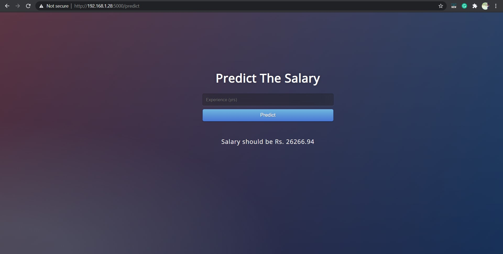

# Deploying Machine Learning Model (Linear Regression) using Flask



## Activate Virtual Environment for Python and Install Dependencies
```

$ python3 -m venv .venv

$ source .venv/bin/activate

$ pip3 install --upgrade pip

$ pip3 install -r requirements.txt

```

## Inorder to run the Flask App 
```
$ export FLASK_APP=app.py

$ export FLASK_ENV=development

$ flask run --host=0.0.0.0

```
